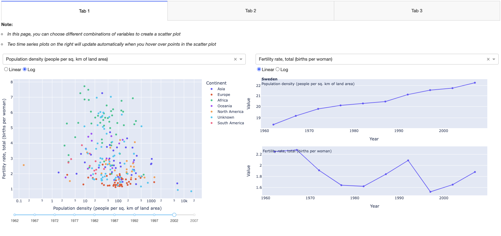

# About this repo

This is a GitHub repo for holding the relevant contents of a dash app deployed by 'Heroku'

You can access this app here: [My dash app](https://countryindicator-c0ef0d61ed55.herokuapp.com/)

Within this dash app, there are three different tabs. 

- In tab 1, you can choose different combinations of variables to create a scatter plot. Two time series plots on the right will update automatically when you hover over points in the scatter plot.
- In tab 2, you can further explore the relationship among variables by choosing multiple input variables (>1) to create a scatter-matrix plot.
- In tab 3, you will find three different animation plots, including a scatter plot, a box plot, and a 3D scatter plot, displaying the relationship of CO2 emissions with several other variables.

